# Tugas Praktikum { Pertemuan ke 14 } 


## Profil
| Variable | Isi |
| -------- | --- |
| **Nama** | ALVIN ALFANDY |
| **NIM** | 312310473 |
| **Kelas** | TI.23.A5 |
| **Mata Kuliah** | Basis data |


***Query MySQL Pada Tabel Perusahaan***

```
CREATE TABLE Perusahaan(
id_p VARCHAR(10) PRIMARY KEY,
nama VARCHAR(45) NOT NULL,
alamat VARCHAR(45) DEFAULT NULL
);

INSERT INTO Perusahaan VALUES
('P01', 'Kantor Pusat', NULL),
('P02', 'Cabang Bekasi', NULL);
SELECT * FROM Perusahaan;
```

***Output :***

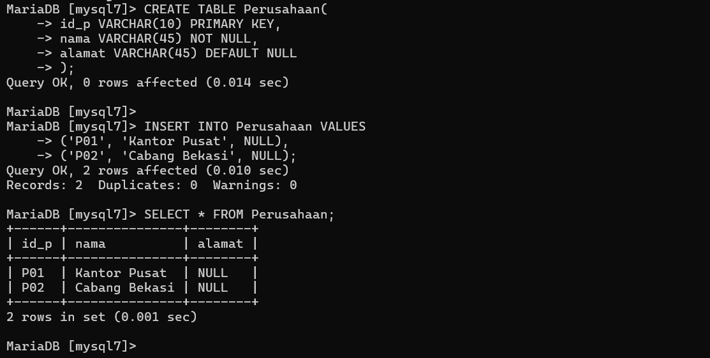


***Query MySQL Pada Tabel Departemen***

```
CREATE TABLE Departemen(
id_dept VARCHAR(10) PRIMARY KEY,
nama VARCHAR(45) NOT NULL,
id_p VARCHAR(10) NOT NULL,
manajer_nik VARCHAR(10) DEFAULT NULL
);

INSERT INTO Departemen VALUES
('D01', 'Produksi', 'P02', 'N01'),
('D02', 'Marketing', 'P01', 'N03'),
('D03', 'RnD', 'P02', NULL),
('D04', 'Logistik', 'P02', NULL);
SELECT * FROM Departemen;
```

***Output :***

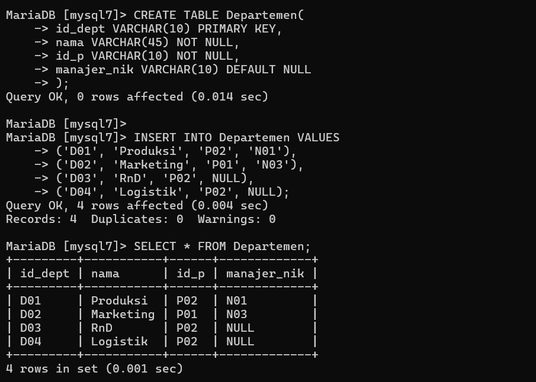


***Query MySQL Pada Tabel Karyawan***

```
CREATE TABLE Karyawan(
nik VARCHAR(10) PRIMARY KEY,
nama VARCHAR(45) NOT NULL,
id_dept VARCHAR(10) NOT NULL,
sup_nik VARCHAR(10) DEFAULT NULL
);

INSERT INTO Karyawan VALUES
('N01', 'Ari', 'D01', NULL),
('N02', 'Dina', 'D01', NULL),
('N03', 'Rika', 'D03', NULL),
('N04', 'Ratih', 'D01', 'N01'),
('N05', 'Riko', 'D01', 'N01'),
('N06', 'Dani', 'D02', NULL),
('N07', 'Anis', 'D02', 'N06'),
('N08', 'Dika', 'D02', 'N06');
SELECT * FROM Karyawan;
```

***Output :***

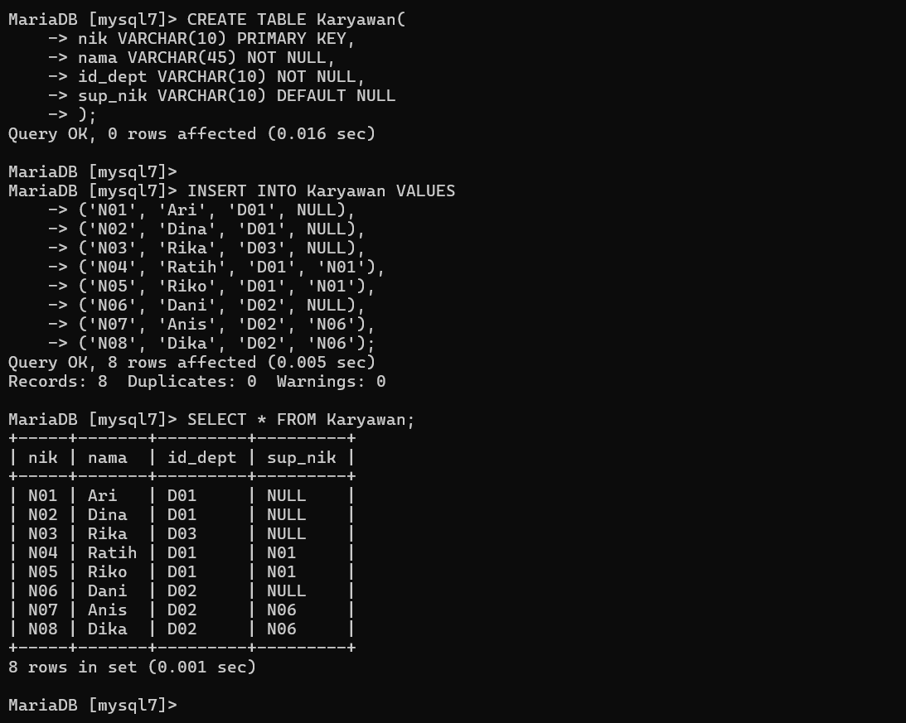


***Query MySQL Pada Tabel Project***

```
CREATE TABLE Project(
id_proj VARCHAR(10) PRIMARY KEY,
nama VARCHAR(45) NOT NULL,
tgl_mulai DATETIME,
tgl_selesai DATETIME,
status TINYINT(1)
);

INSERT INTO Project VALUES
('PJ01', 'A', '2019-01-10', '2019-03-10', '1'),
('PJ02', 'B', '2019-02-15', '2019-04-10', '1'),
('PJ03', 'C', '2019-03-21', '2019-05-10', '1');
SELECT * FROM Project;
```

***Output :***

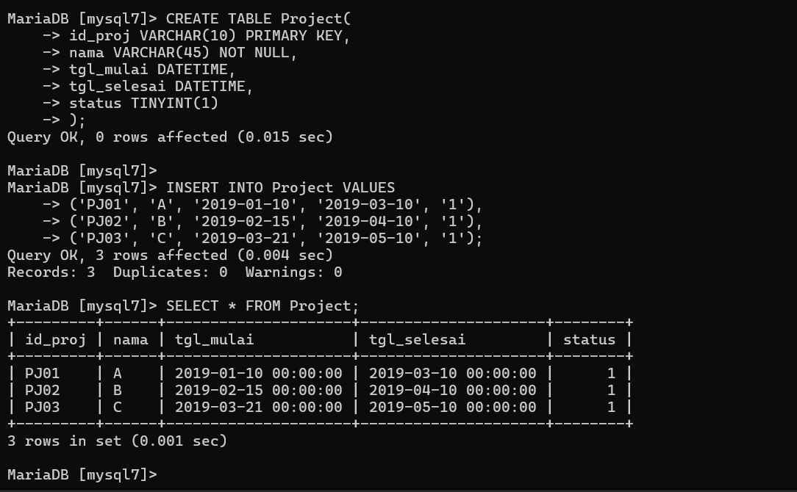


***Query MySQL Pada Tabel Project Deatil***

```
CREATE TABLE Project_detail(
id_proj VARCHAR(10) NOT NULL,
nik VARCHAR(10) NOT NULL
);

INSERT INTO Project_detail VALUES
('PJ01', 'N01'),
('PJ01', 'N02'),
('PJ01', 'N03'),
('PJ01', 'N04'),
('PJ01', 'N05'),
('PJ01', 'N07'),
('PJ01', 'N08'),
('PJ02', 'N01'),
('PJ02', 'N03'),
('PJ02', 'N05'),
('PJ03', 'N03'),
('PJ03', 'N07'),
('PJ03', 'N08');
SELECT * FROM Project_detail;
```

***Output :***

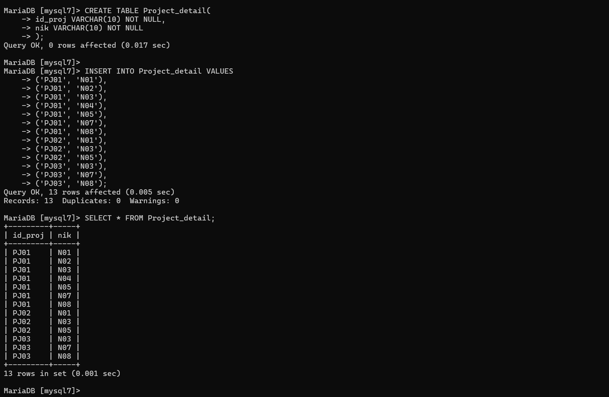


## Menampilkan Nama Manajer Tiap Departemen

```
Select Departemen.nama AS Departemen, Karyawan.nama AS Manajer
FROM Departemen
LEFT JOIN Karyawan ON Karyawan.nik = Departemen.manajer_nik;
```

***Output :***

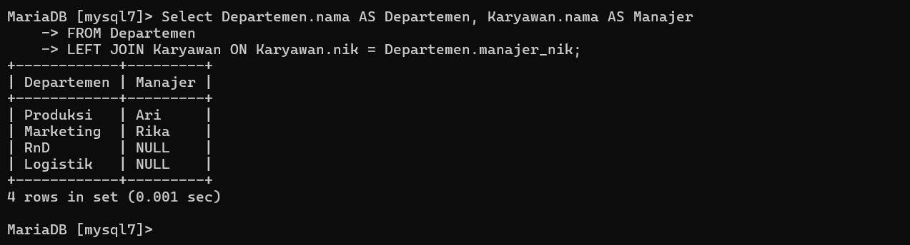


## Menampilkan Nama Supervisor Tiap Karyawan

```
SELECT Karyawan.nik, Karyawan.nama, Departemen.nama AS Departemen, Supervisor.nama AS Supervisor
FROM Karyawan
LEFT JOIN Karyawan AS Supervisor ON Supervisor.nik = Karyawan.sup_nik
LEFT JOIN Departemen ON Departemen.id_dept = Karyawan.id_dept;
```
***Output :***

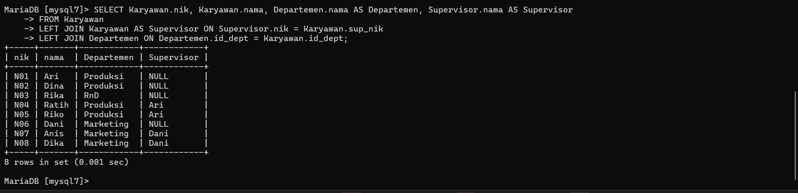


## Menampilkan Daftar Karyawan Yang Bekerja Pada Project A
```
SELECT Karyawan.nik, Karyawan.nama
FROM Karyawan
JOIN Project_detail ON Project_detail.nik = Karyawan.nik
JOIN Project ON Project.id_proj = Project_detail.id_proj
WHERE Project.nama = 'A';
```
***Output :***

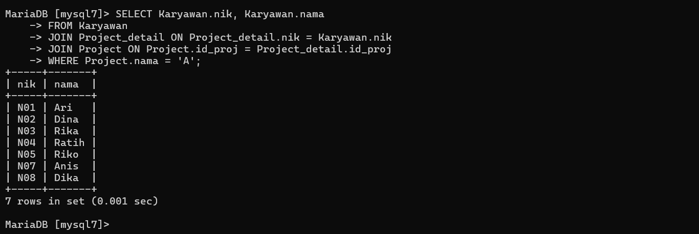

# Soal Latihan Praktikum
- Buat query untuk menampilkan:
1. Departemen apa saja yang terlibat dalam tiap-tiap project
2. Jumlah karyawan tiap departemen yang bekerja pada tiap-tiap
project
3. Ada berapa project yang sedang dikerjakan oleh departemen RnD?
(ket: project berjalan adalah yang statusnya 1)
4. Berapa banyak project yang sedang dikerjakan oleh Ari?
5. Siapa saja yang mengerjakan projcet B?


# Soal Latihan Praktikum

## 1. Departemen Apa Saja Yang Terlibat Dalam Tiap-tiap Project.

```
SELECT Project.nama AS Project, GROUP_CONCAT(Departemen.nama) AS Departemen
FROM Project
INNER JOIN Project_detail ON Project.id_proj = Project_detail.id_proj
INNER JOIN Karyawan ON Project_detail.nik = Karyawan.nik
INNER JOIN Departemen ON Karyawan.id_dept = Departemen.id_dept
GROUP BY Project.id_proj;
```
***Output :***

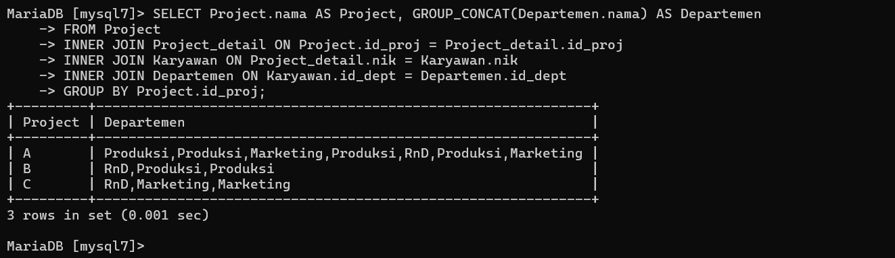


## 2. Jumlah Karyawan Tiap Departemen Yang Bekerja Pada Tiap-tiap Project.

```
SELECT Project.nama AS Project, Departemen.nama AS Departemen, COUNT(*) AS 'Jumlah Karyawan'
FROM Project
INNER JOIN Project_detail ON Project.id_proj = Project_detail.id_proj
INNER JOIN Karyawan ON Project_detail.nik = Karyawan.nik
INNER JOIN Departemen ON Karyawan.id_dept = Departemen.id_dept
GROUP BY Project.id_proj, Departemen.id_dept;
```
***Output :***

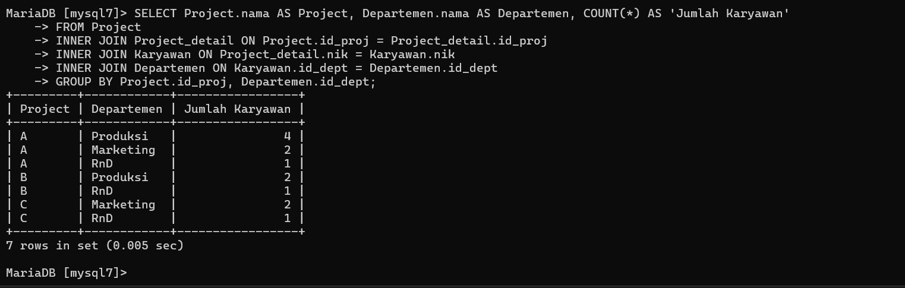


## 3. Ada Berapa Project Yang Sedang Dikerjakan Oleh Departemen ***RnD***? (ket: project berjalan adalah yang statusnya 1).

```
SELECT COUNT(*) AS 'Jumlah Project'
FROM Project
INNER JOIN Project_detail ON Project.id_proj = Project_detail.id_proj
INNER JOIN Karyawan ON Project_detail.nik = Karyawan.nik
INNER JOIN Departemen ON Karyawan.id_dept = Departemen.id_dept
WHERE Departemen.nama = 'RnD' AND Project.status = 1;
```
***Output :***

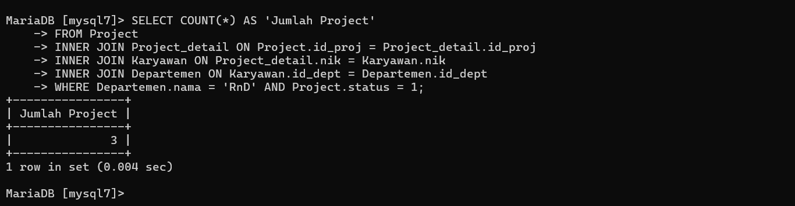


## 4. Berapa banyak Project yang sedang dikerjakan oleh Ari ?

```
SELECT COUNT(*) AS 'Jumlah Project'
FROM Project_detail
INNER JOIN Karyawan ON Project_detail.nik = Karyawan.nik
WHERE Karyawan.nama = 'Ari' AND Project_detail.id_proj IN (SELECT id_proj FROM Project WHERE status = 1);
```
***Output :***

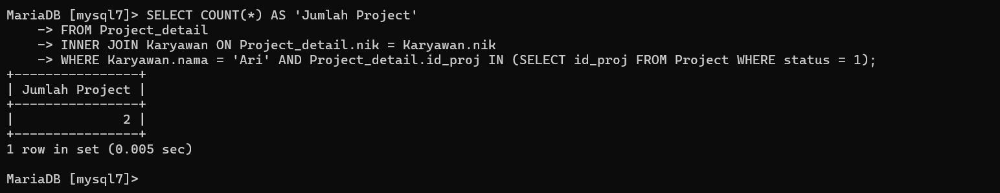


## 5. Siapa Saja Yang Mengerjakan Project B ?

```
SELECT Karyawan.nama
FROM Project_detail
INNER JOIN Karyawan ON Project_detail.nik = Karyawan.nik
WHERE Project_detail.id_proj IN (SELECT id_proj FROM Project WHERE nama = 'B');
```
***Output :***

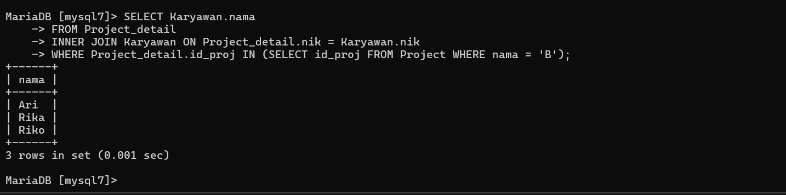


# Model Entitas-Relasi (ERD)

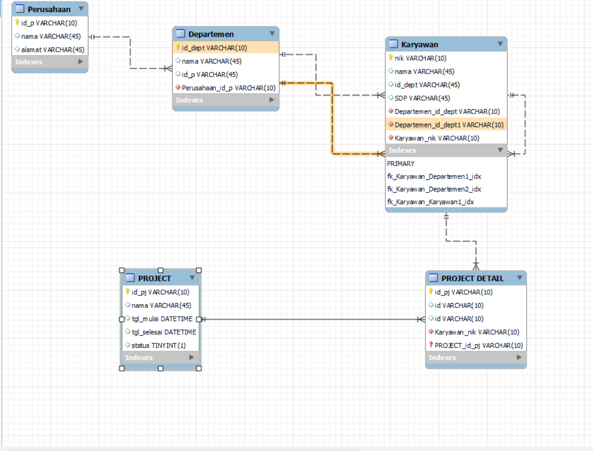